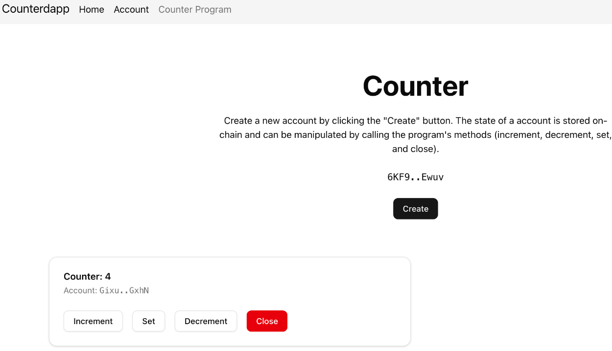

# counter-dapp

This is a Next.js app containing:

- Tailwind CSS setup for styling
- Useful wallet UI elements setup using [@solana/web3.js](https://www.npmjs.com/package/@solana/web3.js)
- A basic Counter Solana program written in Anchor
- UI components for interacting with the Counter program

## Expected Result



## Getting Started

### Installation

#### Download the template

```shell
pnpm create solana-dapp@latest -t gh:solana-foundation/templates/web3js/counter-dapp
```

#### Install Dependencies

```shell
pnpm install
```

## Apps

### anchor

This is a Solana program written in Rust using the Anchor framework.

#### Commands

You can use any normal anchor commands. Either move to the `anchor` directory and run the `anchor` command or prefix the
command with `pnpm`, eg: `pnpm anchor`.

#### Sync the program id:

Running this command will create a new keypair in the `anchor/target/deploy` directory and save the address to the
Anchor config file and update the `declare_id!` macro in the `./src/lib.rs` file of the program.

You will manually need to update the constant in `anchor/lib/counter-exports.ts` to match the new program id.

```shell
pnpm anchor keys sync
```

#### Build the program:

```shell
pnpm anchor-build
```

#### Start the test validator with the program deployed:

```shell
pnpm anchor-localnet
```

#### Run the tests

```shell
pnpm anchor-test
```

#### Deploy to Devnet

```shell
pnpm anchor deploy --provider.cluster devnet
```

### web

This is a React app that uses the Anchor generated client to interact with the Solana program.

#### Commands

Start the web app

```shell
pnpm dev
```

Build the web app

```shell
pnpm build
```
